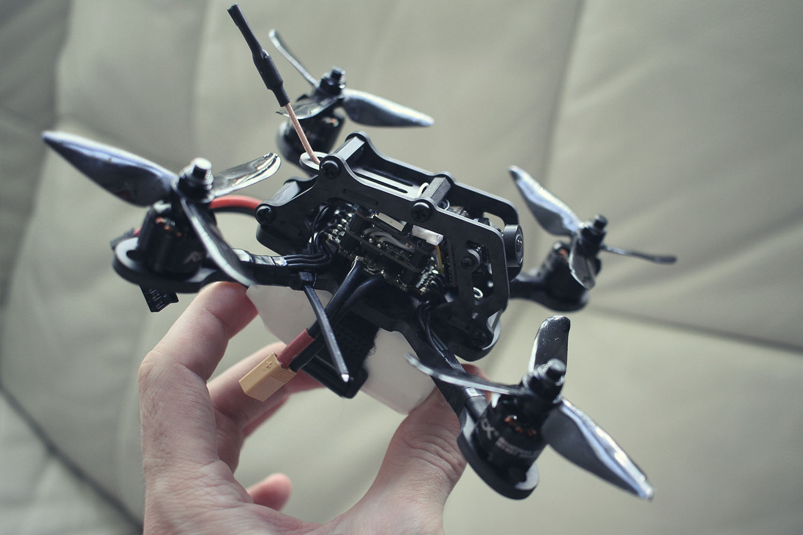

# XBL3
Custom 3" racing drone spec sheet



* Dry Weight 135.5g
* [Betaflight](https://github.com/betaflight/betaflight) 3.3+ firmware
* 3 min flight time
* 2.4Ghz Control link
* 5.8Ghz Video link
* Recommended LiPo 650mAh - 800mAh
* Speed 90mph+

```
Check your local regulations for operating on these radio frequencies.
```

```
Check your local aviation authorities for UAV operating regulations.
```

## Part List

### Frame
[TomoQuads XBL2](https://performance-rotors.com/product/tomoquads-xbl2-race-frame-kit-v1-1-xtreme-edition/)

*Alternative: 
[PUDA XBL140](https://www.banggood.com/PUDA-XBL140-140mm-3-Inch-Mini-RC-Drone-FPV-Racing-Frame-Kit-4mm-Arm-Carbon-Fiber-p-1243033.html?p=3F201911077692015010&utm_campaign=rb&utm_content=zhangruihua) **(clone)***

### Motors
[RCX H1407(V2)](http://www.myrcmart.com/rcx-h1407-v2-5000kv-micro-outrunner-brushleass-motor-its-time-to-upgrade-your-1306-motor-p-9436.html)


> Any 1407 (14mm diameter, 7mm stator height) will do, observe KV rating


### Fligt Controller
[HGLRC XJB F440](https://www.banggood.com/HGLRC-XJB-F440-TX20_V2-Omnibus-F4-Flight-Controller-OSD-40A-Blheli_32-3-5S-ESC-25100200350mW-VTX-p-1242937.html?p=3F201911077692015010&utm_campaign=rb&utm_content=zhangruihua)

> The XJB comes as an ESC(Electronic Speed Controller) + FC(Flight controller) + VTX(video transmitter) combo and is an all-in-one solution.
Any flight controller with 20x20 mounting pattern should do, but AIO is cheaper and require less soldering.


### RX
[FRSky XM+](https://www.banggood.com/Frsky-XM-Micro-D16-SBUS-Full-Range-Receiver-Up-to-16CH-p-1110020.html)

### FPV
[Foxeer Predator Micro](http://surveilzone.com/Foxeer-Predator-Micro-Camera-FPV-OSD-1000TVL-Super-WDR-g-2120)

> *Alternatives:*
> * [*Runcam Micro Series*](https://shop.runcam.com/cameras/)
> * [*Foxeer Micro Series*](http://surveilzone.com/CMOS-Camera-t-313)

### Propellers
[DALPROP Cyclone T3056C](http://surveilzone.com/2-Pairs-3-blade-DALPROP-CYCLONE-T3056C-Props-for-FPV-Racing-g-2137)

> *Alternatives:*
> * [*iFlight Nazhul T3061*](http://www.iflight-rc.com/iflight-nazgul-t3061-3-inch-3-blade-pc-material-propeller-cw-ccw.html)
> * [*Gemfan 3052*](https://www.banggood.com/2-Pairs-Gemfan-Flash-3052-PC-3-blade-Propeller-5mm-Mounting-Hole-for-1306-1806-Motor-RC-FPV-Racing-Drone-p-1179233.html)
> * [*DYS 3045*](https://www.banggood.com/1-Pair-DYS-3045-3-Inch-3-Blade-Propeller-Triblade-Bullnose-Prop-Red-Orange-Yellow-Green-Blue-Purple-p-1117192.html)

> 30XX where 30 = 3" diameter, XX = blade pitch.
Different pitch offer different thrust, efficiency, amp draw and battery sag.

### Batteries
[CNHL 650mAh 70C](https://chinahobbyline.com/index.php?route=product/product&product_id=1)

> 4S 14.4V(nominal) Lithium Polymer battery.
Charge to 4.2V per cell max (16.8V)
Discharge to 3.85V per cell for storage voltage (15.4V)

## Links

* [RotorBuilds Page](https://rotorbuilds.com/build/9573)
* [Youtube](http://youtube.com/c/nomand)
* [Instagram](instagram.com/nomand/)
* [Twitter](http://twitter.com/nomand)
